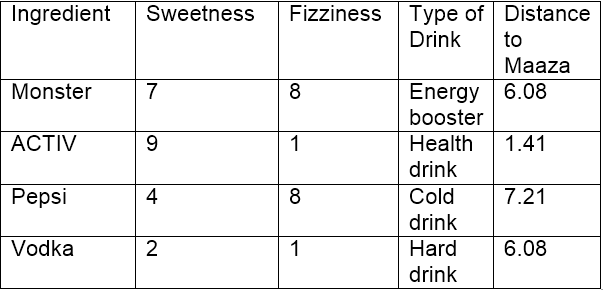
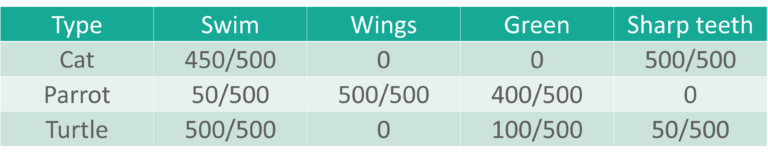
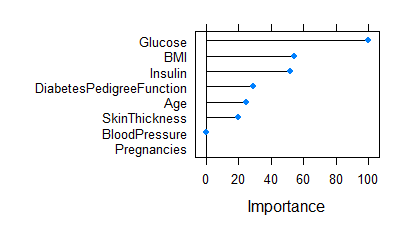

```{r setup, include=FALSE}
knitr::opts_chunk$set(echo = FALSE)
```

## Partea I:KNN

## Cuprins

- Ce este algoritmul KNN?
- Cum se selectează valoarea k adecvată?
- Exemplu de algoritm kNN
- Avantaje si dezavantaje
- Studiu de caz: Detectarea cancerului de prostată


## Ce este algoritmul kNN?

  Să presupunem că avem mai multe grupuri de mostre etichetate. Elementele prezente în grupuri sunt de natură omogene. Acum, să presupunem că avem un exemplu neetichetat care trebuie clasificat într-unul dintre mai multe grupuri etichetate. Cum facem asta? Fără ezitare, folosind algoritmul kNN.

  "k vecini cei mai apropiați"(kNN) este un algoritm simplu care stochează toate cazurile disponibile și clasifică cazurile noi cu votul majorității celor k vecini ai săi. Acesti algoritmi separă punctele de date neetichetate în grupuri bine definite.
  
{width=40%}

## Cum se selectează valoarea k adecvată?

  Alegerea numărului de vecini cei mai apropiați, adică determinarea valorii lui k joacă un rol semnificativ în determinarea eficacității modelului. Astfel, selectarea lui k va determina cât de bine pot fi utilizate datele pentru a generaliza rezultatele algoritmului kNN. O valoare k mare are beneficii care includ reducerea varianței din cauza datelor zgomotoase; efectul secundar fiind dezvoltarea unei părtiniri din cauza căreia cel care invata tinde să ignore modelele mai mici care pot avea perspective utile.

{width=50%}

  Următorul exemplu vă va oferi o perspectivă practică despre selectarea valorii k adecvate.

## Exemplu de algoritm kNN

  Să luăm în considerare 10 „articole de băut” care sunt evaluate pe doi parametri pe o scară de la 1 la 10. Cei doi parametri sunt „Sweetness” și „Fizziness”. Aceasta este mai mult o evaluare bazată pe percepție și, prin urmare, poate varia între indivizi. Aș lua în considerare evaluările mele (care ar putea diferi) pentru a arata ilustrația ce urmeaza. Evaluările câtorva articole arată astfel:

{width=50%}\
  
  „Sweetness” determină percepția conținutului de zahăr din articole. „Fizziness” constă in prezența bulelor din băutură datorită conținutului de dioxid de carbon. Din nou, toate aceste evaluări folosite se bazează pe percepția personală și sunt strict relative.

{width=50%}

  Din figura de mai sus, este clar că am împărțit cele 10 articole în 4 grupuri și anume, „COLD DRINKS”, „ENERGY DRINKS”, „HEALTH DRINKS” și „HARD DRINKS”. Întrebarea aici este, în ce grup s-ar încadra „Fanta”? Aceasta va fi determinată prin calcularea distanței.


**Calcularea distantei**

  Acum, calcularea distanței dintre „Fanta” și cei mai apropiați vecini ai săi („Monster”, „ACTIV”, „Pepsi”, „Vodka”) necesită utilizarea unei formule de distanță, cea mai populară fiind formula de distanță euclidiană, adică cea mai scurtă distanță dintre 2 puncte care poate fi obținuta folosind o riglă.
  
{width=50%}

  Folosind coordonatele lui Fanta (8,2) și Vodka (2,1), distanța dintre „Fanta” și „Vodka” poate fi calculată ca:
  
    dist(Fanta,Vodka) = 6,08
  
  {width=50%}

  Folosind distanța euclidiană, putem calcula distanța lui Fanta față de fiecare dintre cei mai apropiați vecini ai săi. Distanța dintre Fanta și ACTIV fiind cea mai mică, se poate deduce că Fanta este de aceeași natură cu ACTIV, care, la rândul său, aparține unui grup de băuturi (Health Drinks).

  Dacă k=1, algoritmul consideră ca cel mai apropiat vecin de Fanta este ACTIV; dacă k=3, algoritmul consideră „3” cei mai apropiați vecini de Fanta pentru a compara distanțele (ACTIV, Vodka, Monster) – ACTIV este cel mai apropiat de Fanta
  
## Avantaje si dezavantaje

  **AVANTAJE**
  
  Algoritmul este foarte imparțial în natură și nu face nicio presupunere in prealabil a datelor de bază. Fiind simplu și eficient în natură, este ușor de implementat și a câștigat o bună popularitate.
  
  **DEZAVANTAJE**
  
  Dacă aruncăm o privire mai profundă, acest algoritm nu creează un model, deoarece nu este implicat un proces de abstractizare. Da, procesul de instruire este foarte rapid, deoarece datele sunt stocate literal (deci învață leneș), dar timpul de predicție este destul de mare, lipsesc uneori informații utile. Prin urmare, construirea acestui algoritm necesită timp pentru a fi investit în pregătirea datelor (în special tratarea datelor lipsă și a caracteristicilor categoriale) pentru a obține un model robust.

{width=50%}
  

## Studiu de caz: Detectarea cancerului de prostată

  Învățarea automată este utilizată pe scară largă în industria farmaceutică, în special în detectarea creșterii oncogene (celulele canceroase). Limbajul R se aplica în învățarea automată pentru a construi modele care să prezică creșterea anormală a celulelor, ajutând astfel la detectarea cancerului și ajutand sistemul de sănătate.

  Să vedem procesul de construire a acestui model folosind algoritmul kNN în programarea cu limbajul R. Mai jos veți observa că am explicat fiecare linie de cod scrisă pentru a îndeplini această sarcină.


**Pasul 1: Colectarea datelor**

  Vom folosi un set de date de 100 de pacienți (creat exclusiv în scop de practică) pentru a implementa algoritmul knn și, prin urmare, a interpreta rezultatele. Setul de date a fost pregătit ținând cont de rezultatele care sunt în general obținute din DRE (Digital rectal exam - Examenul rectal digital).
  
  Setul de date este format din 100 de date și 10 variabile (dintre care 8 variabile numerice și o variabilă categorială și este ID) care sunt după cum urmează:
  
1. Rază (Radius)
2. Textură (Texture)
3. Perimetru (Perimeter)
4. Zonă (Area)
5. Finete (Smoothness)
6. Compactitate (Compactness)
7. Simetrie (Symmetry)
8. Dimensiune fractală (Fractal dimension)

  În viața reală, există zeci de parametri importanți necesari pentru a măsura probabilitatea de creștere a cancerului, dar din motive de simplitate, să ne ocupăm de 8 dintre ei.

  Iată cum arată setul de date:
  
  {width=50%}


**Pasul 2: Pregătirea și explorarea datelor**

  Să ne asigurăm că înțelegem fiecare linie de cod înainte de a trece la următoarea etapă:

```{r echo = TRUE}
  prc <- read.csv("/Users/OCTAVIAN/Desktop/DM/KNN and Naive Bayes/Prostate_Cancer.csv")
  str(prc)     #Folosim această comandă pentru a vedea dacă datele sunt structurate sau nu.
```

  Constatăm că datele sunt structurate cu 10 variabile și 100 de date. Dacă observăm setul de date, prima variabilă „id” este unică în natură și poate fi eliminată deoarece nu oferă informații utile.
  
```{r echo = TRUE}
  prc <- prc[-1]   #elimină prima variabilă (id) din setul de date.
  head(prc)
```

  Setul de date conține pacienți care au fost diagnosticați fie cu cancer malign (M) fie cu cancer benign (B).

```{r echo = TRUE}
  table(prc$diagnosis_result)   # ne ajută să obținem numărul de pacienți
```

  (Variabila diagnostic_result este variabila noastră țintă, adică această variabilă va determina rezultatele diagnosticului pe baza celor 8 variabile numerice)

  În cazul în care dorim să redenumim B ca „Benign” și M ca „Malign” și să vedem rezultatele sub formă de procente, putem scrie ca:
  
```{r echo = TRUE}
  prc$diagnosis <- factor(prc$diagnosis_result, levels = c("B", "M"), labels = c("Benign", "Malign"))
  round(prop.table(table(prc$diagnosis)) * 100, digits = 1)   # dă rezultatul sub formă de procente rotunjite la 1 zecimală (și deci cifrele = 1)
```

**Normalizarea datelor numerice**

  Această caracteristică este de o importanță capitală, deoarece scara utilizată pentru valorile pentru fiecare variabilă poate fi diferită. Cea mai bună practică este normalizarea datelor și transformarea tuturor valorilor la o scară comună.
  
```{r echo = TRUE}
  normalize <- function(x) {
    return ((x - min(x)) / (max(x) - min(x))) }
```

  Odată ce rulăm acest cod, ni se cere să normalizăm caracteristicile numerice din setul de date. În loc să normalizăm fiecare dintre cele 8 variabile individuale, folosim:
  
```{r echo = TRUE}
  prc_n <- as.data.frame(lapply(prc[2:9], normalize))
```

  Prima variabilă din setul nostru de date (după eliminarea id-ului) este „diagnosis_result”, care nu este de natură numerică. Deci, pornim de la a 2-a variabilă. Funcția lapply() aplică normalize() fiecărei caracteristici din cadrul de date. Rezultatul final este stocat în cadrul de date prc_n folosind funcția as.data.frame().

  Să verificăm folosind variabila „radius” dacă datele au fost normalizate.
  
```{r echo = TRUE}
  summary(prc_n$radius)
```

```{r echo = TRUE}
  summary(prc_n$perimeter)
```


```{r echo = TRUE}
  summary(prc_n$area)
```

  Rezultatele arată că datele au fost normalizate.
  

**Crearea unui set de date de instruire și testare**

  Algoritmul kNN este aplicat setului de date de antrenament, iar rezultatele sunt verificate pe setul de date de testare.

  Pentru aceasta, am împărțit setul de date în 2 porțiuni în raport de 65:35 (presupus) pentru setul de date de antrenament și, respectiv, de testare. Se poate folosi si un raport cu totul diferit, in functie de cerintele primite.

  Vom împărți cadrul de date prc_n în cadre de date prc_train și prc_test
  
```{r echo = TRUE}
  prc_train <- prc_n[1:65,]
  prc_test <- prc_n[66:100,]
```

  O valoare goală în fiecare dintre afirmațiile de mai sus indică faptul că toate rândurile și coloanele ar trebui incluse.

  Variabila noastră țintă este „diagnosis_result”, pe care nu l-am inclus în seturile noastre de date de instruire și de testare.
  
```{r echo = TRUE}
  prc_train_labels <- prc[1:65, 1]
  prc_test_labels <- prc[66:100, 1]    #Acest cod preia factorul de diagnosticare din coloana 1 a cadrului de date prc și la rândul său creează cadrele de date: prc_train_labels și prc_test_labels.
```


**Pasul 3: Antrenarea unui model pe date**

  Funcția knn() trebuie utilizată pentru a antrena un model, pentru care trebuie să instalăm un pachet „class”. Funcția knn() identifică cei mai apropiați k vecini folosind distanța euclidiană, unde k este un număr specificat de utilizator.

  Trebuie să tastam următoarele comenzi pentru a utiliza knn()
  
```{r echo = TRUE}
  #install.packages("class")
  library(class)
```

  Acum suntem gata să folosim funcția knn() pentru a clasifica datele de testare
  
```{r echo = TRUE}
  prc_test_pred <- knn(train = prc_train, test = prc_test, cl = prc_train_labels, k=10)
```

  Valoarea pentru k este în general aleasă ca rădăcina pătrată a numărului de date(in cazul nostru sunt 100).

  knn() returnează o valoare a factorului de etichete prezise pentru fiecare dintre exemplele din setul de date de testare, care este apoi atribuită cadrului de date prc_test_pred
  
  
  **Pasul 4 – Evaluam performanța modelului**
  
  Am construit modelul, dar trebuie, de asemenea, să verificăm acuratețea valorilor prezise în prc_test_pred dacă se potrivesc cu valorile cunoscute din prc_test_labels. Pentru a asigura acest lucru, trebuie să folosim funcția CrossTable() disponibilă în pachetul „gmodels”.

  Il putem instala folosind:
  
```{r echo = TRUE}
  #install.packages("gmodels")
  library(gmodels)
  CrossTable(x = prc_test_labels, y = prc_test_pred, prop.chisq=FALSE)
```


  Datele de testare sunt formate din 35 de date. Dintre care 7 cazuri au fost prezise cu acuratețe (TN->True Negative) ca fiind benigne (B), ceea ce reprezintă 20%. De asemenea, 16 din 35 de date au fost prezise cu acuratețe (TP-> Adevărate pozitive) ca fiind maligne (M) în natură, ceea ce constituie 45,7%. Astfel, un total de 16 din 35 de predicții au fost TP și anume, de natură adevărată pozitivă.

  Nu au existat cazuri de Fals Negative (FN), ceea ce înseamnă că nu au fost înregistrate cazuri care de fapt sunt de natură malignă, dar au fost prezise ca fiind benigne. FN-urile, dacă există, reprezintă o potențială amenințare din același motiv, iar obiectivul principal pentru a crește acuratețea modelului este reducerea FN-urilor.

  Au existat 12 cazuri de fals pozitive (FP), ceea ce înseamnă că 12 cazuri au fost de fapt de natură benigne, dar au fost prezise ca fiind maligne.

  Precizia totală a modelului este de 65%( (TN+TP)/35), ceea ce arată că pot exista șanse de îmbunătățire a performanței modelului
  
  
  
  **Pasul 5 – Îmbunătățiți performanța modelului**
  
  Acest lucru poate fi luat în considerare prin repetarea pașilor 3 și 4 și prin modificarea valorii k. În general, este rădăcina pătrată a observațiilor și în acest caz am luat k=10, care este o rădăcină pătrată perfectă de 100. Valoarea k poate fi fluctuată în și în jurul valorii de 10 pentru a verifica acuratețea crescută a modelului. De asemenea, valoarea FN-urilor trebuie sa fie mentinuta cat mai scazut posibil.


##Partea a II-a: Naive Bayes

## Cuprins

- Ce este Naive Bayes?
- Matematica din spatele lui Naive Bayes
- Teorema Bayes pentru algoritmul Naive Bayes
- Cum functioneaza Naive Bayes?
- Implementarea in R a algorimului Naive Bayes

## Ce este Naive Bayes?

**Definiție**\

- un algoritm de învățare automată\
- rezolva probleme de clasificare\
- variabilele de predicție sunt independente unele de altele\
- rezultatul unui model depinde de un set de variabile independente care nu au nicio legătură între ele.\

**De ce se numește algoritmul Naive Bayes, "Naive"?**\

- variabilele de predicție nu sunt întotdeauna independente\
- există întotdeauna unele corelații între ele\
- fiecare variabilă de predicție este independentă de orice altă variabilă din model\


## Matematica din spatele algoritmului Naive Bayes

- teorema Bayes este cunoscută și sub numele de regula Bayes\
- folosită pentru a calcula probabilitatea condiționată\
- este reprezentată de formula: $P(A|B)=\frac{ P(B|A)P(A)}{P(B)}$, unde:\

P(A|B): probabilitatea condiționată ca evenimentul A să aibe loc, oferindu-se evenimentul B\
P(A): Probabilitatea ca evenimentul A să aibe loc\
P(B): Probabilitatea ca evenimentul B să aibe loc\
P(B|A): probabilitatea condiționată ca evenimentul B să aibe loc, oferindu-se evenimentul A\

- Noțiunile teoremei bayesiene sunt următoarele:

A este cunoscut ca o afirmație și B este dovada\
P(A) reprezintă probabilitatea anterioară a afirmației\
P(B) reprezintă probabilitatea anterioară a dovezilor\
P(A|B) este probabilitatea noua\
P(B|A) este probabilitatea veche\

## Teorema Bayes pentru algoritmul Naive Bayes


Obiectivul este de a măsura probabilitatea condiționată a unui eveniment cu un vector caracteristic x1,x2,...,xn aparținând unei anumite clase Ci

$P(C_i|x_1,x_2,....,x_n)=\frac{P(x_1,x_2,....,x_n|C_i).P(C_i)}{P(x_1,x_2,....,x_n)}$ for 1 < i < k\

Calculând ecuația de mai sus, obținem:

$P(x_1,x_2,....,x_n|C_i).P(C_i)= P(x_1,x_2,....,x_n,C_i)$\
$P(x_1,x_2,....,x_nC_i)= P(x_1|x_2,....,x_n,C_i).P(x_2,....,x_n,C_i)=$\
$= P(x_1|x_2,....,x_n,C_i).P(x_2|x_3,....,x_n,C_i)P(x_3,....,x_n,C_i)$\
$= ....$\
$= P(x_1|x_2,.....,x_n,C_i).P(x_2|x_3,....,x_n,C_i)...P(x_{n-1}|x_n,C_i).P(x_n|C_i).P(C_i)$\

Totuși, probabilitatea condiționată, adică, P(xj|xj+1,…,xn,Ci) se însumează la P(xj|Ci), deoarece fiecare variabilă de predicție este independentă în Naive Bayes.\

Ecuația finală se reduce la:

$P(C_i|x_1,x_2,....,x_n)=(\prod_{j=1}^{j=n} P)(x_j|C_i) ).\frac{P(C_i)}{P(x_1,x_2,....,x_n)}$ pentru 1 < i < k


## Cum funcționează Naive Bayes?

**Studiu de caz: Predicția animalelor**

Vom lua în considerare un set de date cu 1500 de date și următoarele date de ieșire:

- Pisică
- Papagal
- Broască țestoasă

Variabilele de predicție sunt de natură categorială, adică stochează valori, fie adevărate, fie false:

- Înot
- Aripi
- Verde
- Dinti ascutiti

{width=60%}\


- Scopul: identificarea tipului de animal (pisică, papagal sau broască țestoasă) pe baza variabilelor de predicție(înot, aripi,verde, dinți ascuțiți).

- folosim abordarea Naive Bayes,\
$P(H|Dovezi multiple) =\frac {P(C_1| H)*P(C_2|H)*……*P(C_n|H)* P(H)}{P(Dovezi multiple)}$\

- pentru a verifica dacă animalul este o pisică:\

$P(Pisica | Înot, Verde) =\frac {P(Înot|Pisica) * P(Verde|Pisică) * P(Pisică)} { P(Înot, Verde)} =\frac {0,9 * 0 * 0,333}{ P(Înot, Verde)} = 0$\

- pentru a verifica dacă animalul este un papagal:\
$P(Papagal| Înot, Verde) =\frac {P(Înot|Papagal) * P(Verde|Papagal) * P(Papagal)} { P(Înoat, Verde)}=\frac{ 0,1 * 0,80 * 0,333} {P(înotat , verde)}=\frac{ 0,0264}{ P(înot, verde)}$\

- pentru a verifica dacă animalul este broasca testoasă:\
$P(Broască|Înot, Verde) =\frac{ P(Înot|Broască) * P(Verde|Broască) * P(Broască)}{ P(Înot, Verde)}=\frac {1 * 0,2 * 0,333} {P( Îot , verde)}=\frac {0,0666} {P(Înot, verde)}$\


## Implementare Naive Bayes folosind R

**Studiu de caz: Studierea unui set de date despre diabet și construirea unui model de învățare automată care prezice dacă o persoană are sau nu diabet.**\


Descrierea setului de date: conține 100 de date ale pacienților împreună cu detaliile de sănătate ale acestora.

- Sarcini: Numărul de sarcini până acum
- Glucoză: concentrația de glucoză în plasmă
- Tensiune arterială: tensiune arterială diastolică (mm Hg)
- Grosimea pielii: grosimea pliului pielii triceps (mm)
- Insulină: insulină serică de 2 ore (mu U/ml)
- BMI: indicele de masă corporală (greutate în kg/(înălțime în m)^2)
- DiabetesPedigreeFunction: Diabetes pedigree function
- Varsta
- Variabila răspuns sau variabila de ieșire:\

Rezultat: variabilă de clasă (0 sau 1)\
Logica: pentru a construi un model Bayes naiv pentru a clasifica pacienții ca fiind diabetici sau normali, studiind fișele lor medicale, cum ar fi nivelul de glucoză, vârsta, IMC etc.\

**Pasul 1: Instalarea pachetelor necesare**

```
#install.packages("tidyverse")
library(tidyverse)
#install.packages('ggplot2')
library(ggplot2)
#install.packages('caret')
library(caret)
#install.packages('caretEnsemble')
library(caretEnsemble)
#install.packages('psych')
library(psych)
#install.packages('Amelia')
library(Amelia)
#install.packages('mice')
library(mice)
#install.packages('GGally')
library(GGally)
#install.packages('rpart')
library(rpart)
#install.packages('randomForest')
library(randomForest)
```

```{r,echo=TRUE}
#install.packages("tidyverse")
library(tidyverse)
#install.packages('ggplot2')
library(ggplot2)
#install.packages('caret')
library(caret)
#install.packages('caretEnsemble')
library(caretEnsemble)
#install.packages('psych')
library(psych)
#install.packages('Amelia')
library(Amelia)
#install.packages('mice')
library(mice)
#install.packages('GGally')
library(GGally)
#install.packages('rpart')
library(rpart)
#install.packages('randomForest')
library(randomForest)
```

**Pasul 2: Importarea setului de date**


```{r,echo=TRUE}
data<- read.csv("/Users/OCTAVIAN/Desktop/DM/KNN and Naive Bayes/diabetes.csv")
```

**Pasul 3: Studierea setului de date**

```{r,echo=TRUE}
str(data)
```
```{r, echo=TRUE}
head(data)
```

```{r,echo=TRUE}
describe(data)
```


**Pasul 4: Curățarea datelor**


În fragmentul de cod de mai jos, setăm valorile zero la NA:\

```{r echo = TRUE}
data[, 2:7][data[, 2:7] == 0] <- NA
```

Pentru a verifica câte valori lipsă avem acum,vizualizăm datele:\

```{r, echo = TRUE}
missmap(data)
```

Ilustrațiile de mai sus arată că setul nostru de date are o mulțime de valori lipsă și eliminarea tuturor ne va lăsa cu un set de date și mai mic, prin urmare, putem efectua imput-uri folosind pachetul de șoareci în R.

```{r, echo=TRUE}

mice_mod <- mice(data[, c("Glucose","BloodPressure","SkinThickness","Insulin","BMI")], method='rf')
mice_complete <- complete(mice_mod)
 

data$Glucose <- mice_complete$Glucose
data$BloodPressure <- mice_complete$BloodPressure
data$SkinThickness <- mice_complete$SkinThickness
data$Insulin<- mice_complete$Insulin
data$BMI <- mice_complete$BMI
```


Pentru a verifica daca mai exista valori lipsa, vom folosi din nou diagrama missmap:\

```{r, echo = TRUE}
missmap(data)
```

**Pasul 5: Analiza datelor**

Acum, vom efectua câteva vizualizări pentru a arunca o privire mai bună asupra fiecărei variabile, această etapă este esențială pentru a înțelege semnificația fiecărei variabile de predicție.

```{r, echo=TRUE}
ggplot(data, aes(Age, colour = Outcome)) +
geom_freqpoly(binwidth = 1) + labs(title="Distribuirea varstei in functie de rezultat")
```

```{r, echo=TRUE}

c <- ggplot(data, aes(x=Pregnancies, fill=Outcome, color=Outcome)) +
geom_histogram(binwidth = 1) + labs(title="Distribuirea sarcinilor in functie de rezultat")
c + theme_bw()
```

```{r, echo=TRUE}

P <- ggplot(data, aes(x=BMI, fill=Outcome, color=Outcome)) +
geom_histogram(binwidth = 1) + labs(title="Distribuirea BMI in functie de rezultat")
P + theme_bw()
```

```{r, echo=TRUE}

ggplot(data, aes(Glucose, colour = Outcome)) +
geom_freqpoly(binwidth = 1) + labs(title="Distribuirea Glucozei in functie de rezultat")
```
```{r, echo=TRUE}

ggpairs(data)
```

**Pasul 6: Modelarea datelor**

Această etapă începe cu un proces numit Data Splicing, în care setul de date este împărțit în două părți:\

- Set de instruire\
- Set de testare\

```{r, echo=TRUE}

indxTrain <- createDataPartition(y = data$Outcome,p = 0.75,list = FALSE)
training <- data[indxTrain,]
testing <- data[-indxTrain,]
 

 
prop.table(table(training$Outcome)) * 100

```

Pentru a compara rezultatul fazei de instruire și testare, să creăm variabile separate care stochează valoarea variabilei răspuns:\

```{r, echo=TRUE}

x = training[,-9]
y = training$Outcome
```

Acum vom încărca pachetele care conțin algoritmul Naive Bayes\

```{r, echo=TRUE}
library(e1071)
library(klaR)
library(caret)
```

      library(e1071)
      library(klaR)
      library(caret)
\
După încărcarea pachetului, fragmentul de cod de mai jos va crea modelul Naive Bayes utilizând setul de date de antrenament:\

      model = train(x,y,'nb',trControl=trainControl(method='cv',number=10))

{width=60%}

Am creat astfel un model predictiv folosind Clasificatorul Naive Bayes.\

**Pasul 7: Evaluarea modelului**

Pentru a verifica eficiența modelului, acum vom rula setul de date de testare pe model, după care vom evalua acuratețea modelului folosind o matrice de confuzie.\


      Predict <- predict(model,newdata = testing ) 


Rezultatul final arată că am construit un clasificator Naive Bayes care poate prezice dacă o persoană este sau nu diabetică, cu o precizie de aproximativ 73%.\

Pentru a rezuma demonstrația, vom desena o diagramă care arată modul în care fiecare variabilă de predicție este responsabilă independent de prezicerea rezultatului.\

{width=60%}

Din ilustrația de mai sus => că „Glucoza” - cea mai semnificativă variabilă pentru prezicerea rezultatului.\


## Partea a III-a: Comparații între KNN si Naive Bayes

**Unde Bayes excelează:**\

1. Naive Bayes este un clasificator linear, în timp ce K-NN nu este; Tinde să fie mai rapid atunci când este aplicat datelor mari. În comparație, k-nn este de obicei mai lent pentru cantități mari de date, din cauza calculelor necesare pentru fiecare nou pas al procesului. Dacă viteza este importantă, alegeți Naive Bayes în locul K-NN.\
2. În general, Naive Bayes este foarte precis atunci când este aplicat datelor mari. Totuși, nu scoateti din discutie K-NN când vine vorba de precizie; pe măsură ce valoarea lui k în K-NN crește, rata de eroare scade până când ajunge la valoarea ideala Bayes (pentru k→∞).\
3. Naive Bayes vă oferă doi hiperparametri de reglat pentru netezire (smoothing): alfa și beta. Un hiperparametru este un parametru anterior care este reglat pe setul de antrenament pentru a-l optimiza. În comparație, K-NN are o singură opțiune pentru reglare: „k” sau numărul de vecini.\
4. Această metodă nu este afectată de blestemul dimensionalității și seturile mari de caracteristici, în timp ce K-NN are probleme cu ambele.\
5. Pentru sarcini precum robotica și viziunea computerizată, Bayes depășește arborii de decizie.\


**Unde KNN excelează**:\

1. Dacă a avea independență condiționată va afecta foarte negativ clasificarea, veți dori să alegeți K-NN în locul Naive Bayes. Naïve Bayes poate suferi de problema probabilității zero; când probabilitatea condiționată a unui anumit atribut este egală cu zero, Naive Bayes va eșua complet în a produce o predicție validă. Acest lucru ar putea fi rezolvat folosind un estimator laplacian, dar K-NN ar putea ajunge să fie alegerea mai ușoară.\
2. Bayes naiv va funcționa numai dacă granița de decizie este liniară, eliptică sau parabolică. În caz contrar, alegeți K-NN.
3. Naive Bayes necesită să cunoașteți distribuțiile de probabilitate pentru categorii. Algoritmul compară toți ceilalți clasificatori cu acest ideal. Prin urmare, cu excepția cazului în care cunoașteți probabilitățile și fișierele PDF, utilizarea Naïve Bayes este nerealistă. În comparație, K-NN nu necesită să cunoașteți nimic despre distribuțiile de probabilitate.\
4. K-NN nu necesită nicio pregătire - doar încărcați setul de date și pornește. Pe de altă parte, Naive Bayes necesită pregătire.\
5. K-NN (și Naive Bayes) depășesc arborii de decizie atunci când vine vorba de evenimente rare. De exemplu, dacă clasificați tipuri de cancer în populația generală, multe tipuri de cancer sunt destul de rare. Un arbore de decizie va elimina aproape cu siguranță acele clase importante din modelul dvs. Dacă aveți apariții rare, evitați să utilizați arbori de decizie.\


