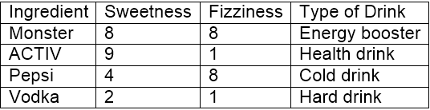
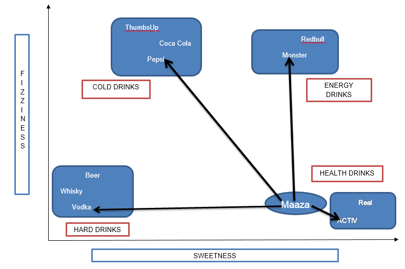
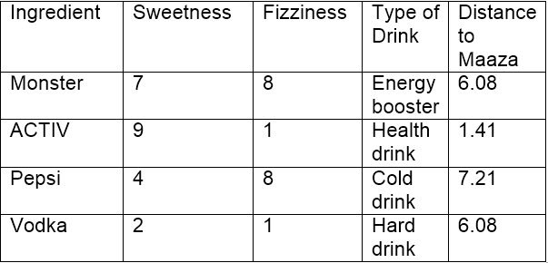
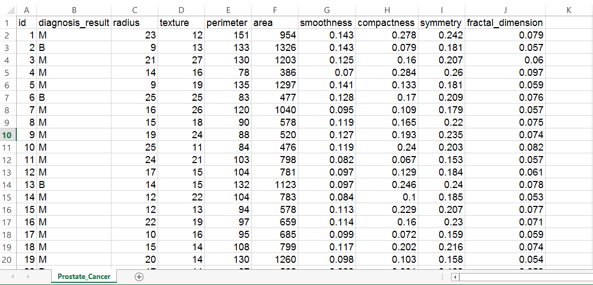
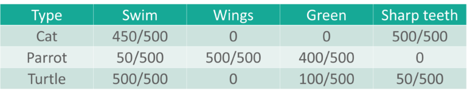
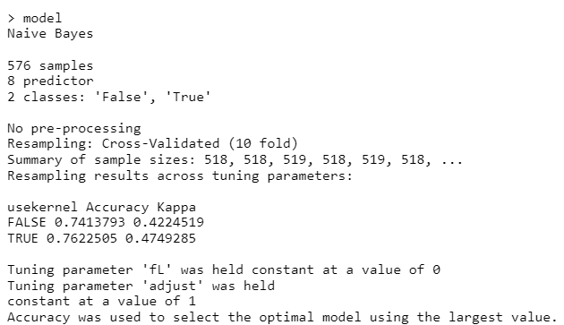
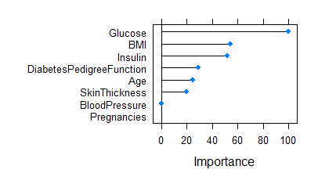

```{r setup, include=FALSE}
knitr::opts_chunk$set(echo = FALSE)
```
## Partea I: KNN

## Cuprins:

1. Ce este algoritmul kNN?
2. Cum se selectează valoarea k adecvată?
3. Exemplu de algoritm kNN
4. Algoritmul kNN - Avantaje și dezavantaje
5. Studiu de caz: Detectarea cancerului de prostată
6. Probleme rezolvate


## 1. Ce este algoritmul kNN?

  Să presupunem că avem mai multe grupuri de mostre etichetate. Elementele prezente în grupuri sunt de natură omogene. Acum, să presupunem că avem un exemplu neetichetat care trebuie clasificat într-unul dintre mai multe grupuri etichetate. Cum facem asta? Fără ezitare, folosind algoritmul kNN.

  "k vecini cei mai apropiați"(kNN) este un algoritm simplu care stochează toate cazurile disponibile și clasifică cazurile noi cu votul majorității celor k vecini ai săi. Acesti algoritmi separă punctele de date neetichetate în grupuri bine definite.


## 2. Cum se selectează valoarea k adecvată?

  Alegerea numărului de vecini cei mai apropiați, adică determinarea valorii lui k joacă un rol semnificativ în determinarea eficacității modelului. Astfel, selectarea lui k va determina cât de bine pot fi utilizate datele pentru a generaliza rezultatele algoritmului kNN. O valoare k mare are beneficii care includ reducerea varianței din cauza datelor zgomotoase; efectul secundar fiind dezvoltarea unei părtiniri din cauza căreia cel care invata tinde să ignore modelele mai mici care pot avea perspective utile.

  Următorul exemplu vă va oferi o perspectivă practică despre selectarea valorii k adecvate.


## 3. Exemplu de algoritm kNN

  Să luăm în considerare 10 „articole de băut” care sunt evaluate pe doi parametri pe o scară de la 1 la 10. Cei doi parametri sunt „Sweetness” și „Fizziness”. Aceasta este mai mult o evaluare bazată pe percepție și, prin urmare, poate varia între indivizi. Aș lua în considerare evaluările mele (care ar putea diferi) pentru a arata ilustrația ce urmeaza. Evaluările câtorva articole arată astfel:

{width=70%}\
  
  „Sweetness” determină percepția conținutului de zahăr din articole. „Fizziness” constă in prezența bulelor din băutură datorită conținutului de dioxid de carbon. Din nou, toate aceste evaluări folosite se bazează pe percepția personală și sunt strict relative.

{width=50%}

  Din figura de mai sus, este clar că am împărțit cele 10 articole în 4 grupuri și anume, „COLD DRINKS”, „ENERGY DRINKS”, „HEALTH DRINKS” și „HARD DRINKS”. Întrebarea aici este, în ce grup s-ar încadra „Fanta”? Aceasta va fi determinată prin calcularea distanței.


**Calcularea distantei**

  Acum, calcularea distanței dintre „Fanta” și cei mai apropiați vecini ai săi („Monster”, „ACTIV”, „Pepsi”, „Vodka”) necesită utilizarea unei formule de distanță, cea mai populară fiind formula de distanță euclidiană, adică cea mai scurtă distanță dintre 2 puncte care poate fi obținuta folosind o riglă.
  
{width=55%}

  Folosind coordonatele lui Fanta (8,2) și Vodka (2,1), distanța dintre „Fanta” și „Vodka” poate fi calculată ca:
  
    dist(Fanta,Vodka) = 6,08
  
  {width=70%}

  Folosind distanța euclidiană, putem calcula distanța lui Fanta față de fiecare dintre cei mai apropiați vecini ai săi. Distanța dintre Fanta și ACTIV fiind cea mai mică, se poate deduce că Fanta este de aceeași natură cu ACTIV, care, la rândul său, aparține unui grup de băuturi (Health Drinks).

  Dacă k=1, algoritmul consideră ca cel mai apropiat vecin de Fanta este ACTIV; dacă k=3, algoritmul consideră „3” cei mai apropiați vecini de Fanta pentru a compara distanțele (ACTIV, Vodka, Monster) – ACTIV este cel mai apropiat de Fanta


## 4. Algoritmul kNN - Avantaje și dezavantaje

  **AVANTAJE**
  
  Algoritmul este foarte imparțial în natură și nu face nicio presupunere in prealabil a datelor de bază. Fiind simplu și eficient în natură, este ușor de implementat și a câștigat o bună popularitate.
  
  **DEZAVANTAJE**
  
  Dacă aruncăm o privire mai profundă, acest algoritm nu creează un model, deoarece nu este implicat un proces de abstractizare. Da, procesul de instruire este foarte rapid, deoarece datele sunt stocate literal (deci învață leneș), dar timpul de predicție este destul de mare, lipsesc uneori informații utile. Prin urmare, construirea acestui algoritm necesită timp pentru a fi investit în pregătirea datelor (în special tratarea datelor lipsă și a caracteristicilor categoriale) pentru a obține un model robust.


## 5. Studiu de caz: Detectarea cancerului de prostată

  Învățarea automată este utilizată pe scară largă în industria farmaceutică, în special în detectarea creșterii oncogene (celulele canceroase). Limbajul R se aplica în învățarea automată pentru a construi modele care să prezică creșterea anormală a celulelor, ajutând astfel la detectarea cancerului și ajutand sistemul de sănătate.

  Să vedem procesul de construire a acestui model folosind algoritmul kNN în programarea cu limbajul R. Mai jos veți observa că am explicat fiecare linie de cod scrisă pentru a îndeplini această sarcină.


**Pasul 1: Colectarea datelor**

  Vom folosi un set de date de 100 de pacienți (creat exclusiv în scop de practică) pentru a implementa algoritmul knn și, prin urmare, a interpreta rezultatele. Setul de date a fost pregătit ținând cont de rezultatele care sunt în general obținute din DRE (Digital rectal exam - Examenul rectal digital).
  
  Setul de date este format din 100 de observații și 10 variabile (dintre care 8 variabile numerice și o variabilă categorială și este ID) care sunt după cum urmează:
  
1. Rază (Radius)
2. Textură (Texture)
3. Perimetru (Perimeter)
4. Zonă (Area)
5. Finete (Smoothness)
6. Compactitate (Compactness)
7. Simetrie (Symmetry)
8. Dimensiune fractală (Fractal dimension)

  În viața reală, există zeci de parametri importanți necesari pentru a măsura probabilitatea de creștere a cancerului, dar din motive de simplitate, să ne ocupăm de 8 dintre ei.

  Iată cum arată setul de date:
  
  {width=80%}


**Pasul 2: Pregătirea și explorarea datelor**

  Să ne asigurăm că înțelegem fiecare linie de cod înainte de a trece la următoarea etapă:

```{r}
  prc <- read.csv("C:/Users/OCTAVIAN/Desktop/DM/KNN and Naive Bayes/Prostate_Cancer.csv")
  str(prc)     #Folosim această comandă pentru a vedea dacă datele sunt structurate sau nu.
```

  Constatăm că datele sunt structurate cu 10 variabile și 100 de observații. Dacă observăm setul de date, prima variabilă „id” este unică în natură și poate fi eliminată deoarece nu oferă informații utile.
  
```{r}
  prc <- prc[-1]   #elimină prima variabilă (id) din setul de date.
  head(prc)
```

  Setul de date conține pacienți care au fost diagnosticați fie cu cancer malign (M) fie cu cancer benign (B).

```{r}
  table(prc$diagnosis_result)   # ne ajută să obținem numărul de pacienți
```

  (Variabila diagnostic_result este variabila noastră țintă, adică această variabilă va determina rezultatele diagnosticului pe baza celor 8 variabile numerice)

  În cazul în care dorim să redenumim B ca „Benign” și M ca „Malign” și să vedem rezultatele sub formă de procente, putem scrie ca:
  
```{r}
  prc$diagnosis <- factor(prc$diagnosis_result, levels = c("B", "M"), labels = c("Benign", "Malign"))
  round(prop.table(table(prc$diagnosis)) * 100, digits = 1)   # dă rezultatul sub formă de procente rotunjite la 1 zecimală (și deci cifrele = 1)
```

**Normalizarea datelor numerice**

  Această caracteristică este de o importanță capitală, deoarece scara utilizată pentru valorile pentru fiecare variabilă poate fi diferită. Cea mai bună practică este normalizarea datelor și transformarea tuturor valorilor la o scară comună.
  
```{r}
  normalize <- function(x) {
    return ((x - min(x)) / (max(x) - min(x))) }
```

  Odată ce rulăm acest cod, ni se cere să normalizăm caracteristicile numerice din setul de date. În loc să normalizăm fiecare dintre cele 8 variabile individuale, folosim:
  
```{r}
  prc_n <- as.data.frame(lapply(prc[2:9], normalize))
```

  Prima variabilă din setul nostru de date (după eliminarea id-ului) este „diagnosis_result”, care nu este de natură numerică. Deci, pornim de la a 2-a variabilă. Funcția lapply() aplică normalize() fiecărei caracteristici din cadrul de date. Rezultatul final este stocat în cadrul de date prc_n folosind funcția as.data.frame().

  Să verificăm folosind variabila „radius” dacă datele au fost normalizate.
  
```{r}
  summary(prc_n$radius)
```

```{r}
  summary(prc_n$perimeter)
```


```{r}
  summary(prc_n$area)
```

  Rezultatele arată că datele au fost normalizate.
  

**Crearea unui set de date de instruire și testare**

  Algoritmul kNN este aplicat setului de date de antrenament, iar rezultatele sunt verificate pe setul de date de testare.

  Pentru aceasta, am împărțit setul de date în 2 porțiuni în raport de 65:35 (presupus) pentru setul de date de antrenament și, respectiv, de testare. Se poate folosi si un raport cu totul diferit, in functie de cerintele primite.

  Vom împărți cadrul de date prc_n în cadre de date prc_train și prc_test
  
```{r}
  prc_train <- prc_n[1:65,]
  prc_test <- prc_n[66:100,]
```

  O valoare goală în fiecare dintre afirmațiile de mai sus indică faptul că toate rândurile și coloanele ar trebui incluse.

  Variabila noastră țintă este „diagnosis_result”, pe care nu l-am inclus în seturile noastre de date de instruire și de testare.
  
```{r}
  prc_train_labels <- prc[1:65, 1]
  prc_test_labels <- prc[66:100, 1]    #Acest cod preia factorul de diagnosticare din coloana 1 a cadrului de date prc și la rândul său creează cadrele de date: prc_train_labels și prc_test_labels.
```


**Pasul 3: Antrenarea unui model pe date**

  Funcția knn() trebuie utilizată pentru a antrena un model, pentru care trebuie să instalăm un pachet „class”. Funcția knn() identifică cei mai apropiați k vecini folosind distanța euclidiană, unde k este un număr specificat de utilizator.

  Trebuie să tastam următoarele comenzi pentru a utiliza knn()
  
```{r}
  #install.packages("class")
  library(class)
```

  Acum suntem gata să folosim funcția knn() pentru a clasifica datele de testare
  
```{r}
  prc_test_pred <- knn(train = prc_train, test = prc_test, cl = prc_train_labels, k=10)
```

  Valoarea pentru k este în general aleasă ca rădăcina pătrată a numărului de observații(in cazul nostru sunt 100).

  knn() returnează o valoare a factorului de etichete prezise pentru fiecare dintre exemplele din setul de date de testare, care este apoi atribuită cadrului de date prc_test_pred
  
  
  **Pasul 4 – Evaluam performanța modelului**
  
  Am construit modelul, dar trebuie, de asemenea, să verificăm acuratețea valorilor prezise în prc_test_pred dacă se potrivesc cu valorile cunoscute din prc_test_labels. Pentru a asigura acest lucru, trebuie să folosim funcția CrossTable() disponibilă în pachetul „gmodels”.

  Il putem instala folosind:
  
```{r}
  #install.packages("gmodels")
  library(gmodels)
  CrossTable(x = prc_test_labels, y = prc_test_pred, prop.chisq=FALSE)
```


  Datele de testare sunt formate din 35 de observații. Dintre care 7 cazuri au fost prezise cu acuratețe (TN->True Negative) ca fiind benigne (B), ceea ce reprezintă 20%. De asemenea, 16 din 35 de observații au fost prezise cu acuratețe (TP-> Adevărate pozitive) ca fiind maligne (M) în natură, ceea ce constituie 45,7%. Astfel, un total de 16 din 35 de predicții au fost TP și anume, de natură adevărată pozitivă.

  Nu au existat cazuri de Fals Negative (FN), ceea ce înseamnă că nu au fost înregistrate cazuri care de fapt sunt de natură malignă, dar au fost prezise ca fiind benigne. FN-urile, dacă există, reprezintă o potențială amenințare din același motiv, iar obiectivul principal pentru a crește acuratețea modelului este reducerea FN-urilor.

  Au existat 12 cazuri de fals pozitive (FP), ceea ce înseamnă că 12 cazuri au fost de fapt de natură benigne, dar au fost prezise ca fiind maligne.

  Precizia totală a modelului este de 65%( (TN+TP)/35), ceea ce arată că pot exista șanse de îmbunătățire a performanței modelului
  
  
  
  **Pasul 5 – Îmbunătățiți performanța modelului**
  
  Acest lucru poate fi luat în considerare prin repetarea pașilor 3 și 4 și prin modificarea valorii k. În general, este rădăcina pătrată a observațiilor și în acest caz am luat k=10, care este o rădăcină pătrată perfectă de 100. Valoarea k poate fi fluctuată în și în jurul valorii de 10 pentru a verifica acuratețea crescută a modelului. De asemenea, valoarea FN-urilor trebuie sa fie mentinuta cat mai scazut posibil.
  
  
## 6. Exercitii

**Problem 7.3 | Predicting Housing Median Prices**

**Problema**

  Fișierul BostonHousing.csv conține informații despre peste 500 de sectoare de recensământ din Boston, unde pentru fiecare secție sunt înregistrate mai multe variabile. Ultima coloană (CAT.MEDV) a fost derivată din MEDV, astfel încât să obțină valoarea 1 dacă MEDV > 30 și 0 în caz contrar. Luați în considerare scopul de a prezice valoarea mediană (MEDV) a unui tract, având în vedere informațiile din primele 12 coloane.
  
**Data**

  Încărcarea fisierului ce contine datele (BostonHousing.csv) și instalarea/încărcarea tuturor pachetele necesare. Partiționam datele în seturi de antrenare (60%) și de validare (40%).
  
```{r}
  housing.df <- read.csv("C:/Users/OCTAVIAN/Desktop/DM/KNN and Naive Bayes/BostonHousing.csv")

  set.seed(123)
  train.index <- sample(row.names(housing.df), 0.6*dim(housing.df)[1])  
  valid.index <- setdiff(row.names(housing.df), train.index)  
  train.df <- housing.df[train.index, -14]
  valid.df <- housing.df[valid.index, -14]
```
  
**Part A**

  Efectuam o predicție k-NN cu toți cei 12 predictori (ignoram coloana CAT.MEDV), încercând valori ale lui k de la 1 la 5. Ne asiguram că normalizam datele și alegem funcția knn() din pachetul "class", mai degrabă decât pachetul FNN. Pentru a ne asigura că R folosește pachetul "class" (când ambele pachete sunt încărcate), vom utiliza class::knn(). In cele ce urmeaza vom putea observa care este cel mai bun k si ce inseamna acest lucru.
  
```{r}
  #install.packages("caret")
  library(caret)
  library(ggplot2)
  library(lattice)

  # initializam antrenarea normalizat, datele de validare si completam cadrele de date
  train.norm.df <- train.df
  valid.norm.df <- valid.df
  housing.norm.df <-housing.df

  
  # utilizam preProcess() din pachetul "caret" pentru a normaliza Income si Lot_Size
  
  
  norm.values <- preProcess(train.df, method=c("center", "scale"))
  train.norm.df <- as.data.frame(predict(norm.values, train.df))
  valid.norm.df <- as.data.frame(predict(norm.values, valid.df))
  housing.norm.df <- as.data.frame(predict(norm.values, housing.df))

  
  # initializam un cadru de date cu doua coloane: k si acuratetea
  accuracy.df <- data.frame(k = seq(1, 5, 1), RMSE = rep(0, 5))

  
  # calculam knn pentru diferiti k pe validare
  for(i in 1:5){
    knn.pred<-class::knn(train = train.norm.df[,-13],                          
                          test = valid.norm.df[,-13],                          
                          cl = train.df[,13], k = i)
    accuracy.df[i,2]<-RMSE(as.numeric(as.character(knn.pred)),valid.df[,13])
  }

  accuracy.df
```


  k=1 este cea mai bună potrivire, deoarece are cel mai mic RMSE (Root Mean Square Error) (înseamnă că are cea mai mare rată de precizie dintre valorile încercate) Cu toate acestea, nu dorim să folosim k=1 din cauza supraajustării, așa că vom folosi următorul cel mai mic RMSE (k =2). Aceasta înseamnă că, pentru o înregistrare dată, MED (Medvedovic) este prezis prin mediarea MEDV-urilor pentru cele mai apropiate 2 înregistrări, proximitatea fiind măsurată prin distanța dintre vectorii valorilor predictorilor.
  MEDV = 
  
**Part B**

  Prezicem MEDV pentru un tract cu urmatoarele informatii, folosind cel mai bun k:
  
``` {r echo = FALSE}
  #install.packages("knitr")
  library(knitr)

  CATEGORII <- c("A")
  
  CRIM <- c(0.2)
  ZN <- c(0)
  INDUS <- c(7)
  CHAS <- c(0)
  NOX <- c(0.538)
  RM <- c(6)
  AGE <- c(62)
  DIS <- c(4.7)
  RAD <- c(4)
  TAX <- c(307)
  PTRATIO <- c(21)
  LSTAT <- c(10)
  
  tabledata <- data.frame(CATEGORII, CRIM, ZN, INDUS, CHAS, NOX, RM, AGE, DIS, RAD, TAX, PTRATIO, LSTAT)
  
  theme_set(theme_classic())
  
  kable(tabledata)
```


```{r}
  #cream un nou cadru de date cu valorile tabelului
  new.df<-data.frame(0.2,0,7,0,0.538,6,62,4.7,4,307,21,10)
  names(new.df)<-names(train.norm.df)[-13]

  #normalizam noile date
  new.norm.values <- preProcess(new.df, method=c("center", "scale"))
```


```{r}
  new.norm.df <- predict(new.norm.values, newdata = new.df)

  #prezicem MEDV
  new.knn.pred <- class::knn(train = train.norm.df[,-13],
                        test = new.norm.df,
                        cl = train.df$MEDV, k = 2)
  new.knn.pred
```


**Part C**

  Dacă am folosi algoritmul k-NN de mai sus pentru a nota datele de antrenament, sa vedem care ar fi eroarea setului de antrenament
  
```{r}
  new.accuracy.df<-RMSE(as.numeric(as.character(new.knn.pred)),valid.df[,13])
  new.accuracy.df
```


**Part D**

  De ce eroarea datelor de validare este prea optimistă în comparație cu rata de eroare atunci când se aplică acest predictor k-NN la date noi?
  
  Deoarece datele noastre de validare făceau parte din același set din care provin datele noastre de antrenare (ambele fiind derivate din setul nostru de date original), rezultatele noastre sunt prea optimiste, deoarece modelul nostru a fost antrenat în mod esențial pentru a rezolva acel set de date specific.
  
**Part E**
  
  Dacă scopul este de a prezice MEDV pentru câteva mii de noi tracturi, care ar fi dezavantajul utilizării predicției k-NN? Vom enumera operațiile prin care trece algoritmul pentru a produce fiecare predicție.
  
  Dezavantajul major ar fi timpul și comparațiile care ar trebui făcute pentru a determina distanța dintre fiecare nou tract și TOATE exemplele din date. Apoi ar trebui să facă o medie a acestor valori ale celor mai apropiați vecini ai săi pentru a prezice MEDV. Algoritmul ar trebui să treacă prin următoarele operații pentru a produce fiecare predicție:
  
  1. Calculam distanța Mahalanobis de la noul tract pana la exemplul setului de date.
  2. Ordonam punctele de date crescând distanța.
  3. Efectuam o validare încrucișată bazată pe RMSE pentru a găsi cel mai bun număr k de vecini cei mai apropiați.
  4. Calculam media ponderată a distanței inverse cu cei mai apropiați k vecini multivariați.
  


**Problem 7.2 | Universal Bank Classification**

**Problem**

  Banca universală este o bancă mică, dar în creștere. Majoritatea clienților sunt clienți cu răspundere sau numai cu depozit, iar banca este interesată să transforme mai mulți dintre aceștia în clienți activi sau de împrumut. Banca a avut succes în trecut cu campanii de marketing pentru a converti clienții cu răspundere în clienți cu împrumuturi personale. Cu acest succes, banca este interesată să fie mai direcționată în eforturile sale de a se asigura că dolarii de marketing sunt cheltuiți pentru cei cu cele mai multe șanse de a converti. Banca ar dori un model care să o ajute să prezică ce noi clienți sunt susceptibili de a deveni clienți de împrumuturi personale pentru a ajuta la această direcționare.


**Intrebare de Business**

  Putem prezice care clienți noi sunt cel mai probabil să spună da unui împrumut personal?
  
  
**Cerinte**

  1. Perform a k-NN classification with all predictors except ID and ZIP code using k = 1. Remember to transform categorical predictors with more than two categories into dummy variables first. Specify the success class as 1 (loan acceptance), and use the default cutoff value of 0.5. How would this customer be classified?
  
```{r}
library("dplyr")
library("tidyr")
library("ggplot2")
library("ROCR")
library("rpart")
#install.packages("rpart.plot")
library("rpart.plot")
library("caret")
library("randomForest")
library("tidyverse")
#install.packages("tm")
library("tm")
#install.packages("SnowballC")
library("SnowballC")
#install.packages("softImpute")
library("softImpute")
#install.packages("glmnet")
library("glmnet")
#install.packages("Hmisc")
library("Hmisc")
#install.packages("dummies")
library("dummies")
library('tinytex')
library('GGally')
library('gplots')
#install.packages("FNN")
library('FNN')
library("dplyr")
library("tidyr")
library("caTools")
#install.packages("ggpubr")
library("ggpubr")
library("reshape")
```

  a. Consider the following customer: Age = 40, Experience = 10, Income = 84, Family = 2, CCAvg = 2, Education_1 = 0, Education_2 = 1, Education_3 = 0, Mortgage = 0, Securities Account = 0, CD Account = 0, Online = 1, and Credit Card = 1. Perform a k-NN classification with all predictors except ID and ZIP code using k = 1. Remember to transform categorical predictors with more than two categories into dummy variables first. Specify the success class as 1 (loan acceptance), and use the default cutoff value of 0.5. How would this customer be classified?
  
```{r}
rm(list=ls())
bank = read.csv("C:/Users/OCTAVIAN/Desktop/DM/KNN and Naive Bayes/UniversalBank.csv")
bank$Education = as.factor(bank$Education)

bank_dummy = dummy.data.frame(select(bank,-c(ZIP.Code,ID)))
bank_dummy$Personal.Loan = as.factor(bank_dummy$Personal.Loan)
bank_dummy$CCAvg = as.integer(bank_dummy$CCAvg)

set.seed(1)
train.index <- sample(row.names(bank_dummy), 0.6*dim(bank_dummy)[1])  ## need to look at hints
test.index <- setdiff(row.names(bank_dummy), train.index) 
train.df <- bank_dummy[train.index, ]
valid.df <- bank_dummy[test.index, ]

new.df = data.frame(Age = as.integer(40), Experience = as.integer(10), Income = as.integer(84), Family = as.integer(2), CCAvg = as.integer(2), Education1 = as.integer(0), Education2 = as.integer(1), Education3 = as.integer(0), Mortgage = as.integer(0), Securities.Account = as.integer(0), CD.Account = as.integer(0), Online = as.integer(1), CreditCard = as.integer(1))


norm.values <- preProcess(train.df[, -c(10)], method=c("center", "scale"))
train.df[, -c(10)] <- predict(norm.values, train.df[, -c(10)])
valid.df[, -c(10)] <- predict(norm.values, valid.df[, -c(10)])
new.df <- predict(norm.values, new.df)

knn.1 <- knn(train = train.df[,-c(10)],test = new.df, cl = train.df[,10], k=5, prob=TRUE)
knn.attributes <- attributes(knn.1)
knn.attributes[1]
```

```{r}
knn.attributes[3]
```
  Nota: toți cei 5 vecini cei mai apropiați vor fi clasificați ca 0, la rândul său clientul va fi clasificat ca 0.
  
  
  b. What is a choice of k that balances between overfitting and ignoring the predictor information?
  
```{r}
accuracy.df <- data.frame(k = seq(1, 14, 1), accuracy = rep(0, 14))

for(i in 1:14) {
  knn.2 <- knn(train = train.df[,-10],test = valid.df[,-10], cl = train.df[,10], k=i, prob=TRUE)
  accuracy.df[i, 2] <- confusionMatrix(knn.2, valid.df[,10])$overall[1]
}
accuracy.df
```
  Raspuns: cea mai bună alegere a lui k care echilibrează și modelul de la supraajustare este k = 3
  
  c. Show the confusion matrix for the validation data that results from using the best k.
  
```{r}
knn.3 <- knn(train = train.df[,-10],test = valid.df[,-10], cl = train.df[,10], k=3, prob=TRUE)
confusionMatrix(knn.3, valid.df[,10])
```
  
  d. Consider the following customer: Age = 40, Experience = 10, Income = 84, Family = 2, CCAvg = 2, Education_1 = 0, Education_2 = 1, Education_3 = 0, Mortgage = 0, Securities Account = 0, CD Account = 0, Online = 1 and Credit Card = 1. Classify the customer using the best k.
  
```{r}
customer.df= data.frame(Age = 40, Experience = 10, Income = 84, Family = 2, CCAvg = 2, Education_1 = 0, Education_2 = 1, Education_3 = 0, Mortgage = 0, Securities.Account = 0, CD.Account = 0, Online = 1, CreditCard = 1)
knn.4 <- knn(train = train.df[,-10],test = customer.df, cl = train.df[,10], k=3, prob=TRUE)
knn.4
```
  Raspuns: clientul este clasificat ca 1 cu 100% probabilitate
  
  e. Repartition the data, this time into training, validation, and test sets (50% : 30% : 20%). Apply the k-NN method with the k chosen above. Compare the confusion matrix of the test set with that of the training and validation sets. Comment on the differences and their reason
  
```{r}
bank_dummy = dummy.data.frame(select(bank,-c(ZIP.Code,ID)))
bank_dummy$Personal.Loan = as.factor(bank_dummy$Personal.Loan)
bank_dummy$CCAvg = as.integer(bank_dummy$CCAvg)

set.seed(1)
train.index <- sample(rownames(bank_dummy), 0.5*dim(bank_dummy)[1])  ## need to look at hints
set.seed(1)
valid.index <- sample(setdiff(rownames(bank_dummy),train.index), 0.3*dim(bank_dummy)[1])
test.index = setdiff(rownames(bank_dummy), union(train.index, valid.index))

train.df <- bank_dummy[train.index, ]
valid.df <- bank_dummy[valid.index, ]
test.df <- bank_dummy[test.index, ]

norm.values <- preProcess(train.df[, -c(10)], method=c("center", "scale"))
train.df[, -c(10)] <- predict(norm.values, train.df[, -c(10)])
valid.df[, -c(10)] <- predict(norm.values, valid.df[, -c(10)])
test.df[,-c(10)] <- predict(norm.values, test.df[,-c(10)])

testknn <- knn(train = train.df[,-c(10)],test = test.df[,-c(10)], cl = train.df[,10], k=3, prob=TRUE)
validknn <- knn(train = train.df[,-c(10)],test = valid.df[,-c(10)], cl = train.df[,10], k=3, prob=TRUE)
trainknn <- knn(train = train.df[,-c(10)],test = train.df[,-c(10)], cl = train.df[,10], k=3, prob=TRUE)

confusionMatrix(testknn, test.df[,10])
```


```{r}
confusionMatrix(validknn, valid.df[,10])
```


```{r}
confusionMatrix(trainknn, train.df[,10])
```


  Raspuns: Acuratete testare: 0,964
           Acuratete valida: 0,9667
           Acuratete antrenare: 0,978

  Pe măsură ce modelul se potrivește cu datele de antrenament, ar avea sens intuitiv ca clasificările să fie cele mai precise pe setul de date de antrenament și cel mai puțin precise pe seturile de date de testare.

## Partea a II -a: Naive Bayes

## Cuprins

- Ce este Naive Bayes?
- Matematica din spatele lui Naive Bayes
- Teorema Bayes pentru algoritmul Naive Bayes
- Cum functioneaza Naive Bayes?
- Implementarea in R a algorimului Naive Bayes
- Problema rezolvata

## Ce este Naive Bayes?

Naive Bayes este un algoritm de învățare automată bazat pe teorema Bayes, care este utilizat pentru a rezolva probleme de clasificare urmând o abordare probabilistică. Se bazează pe ideea că variabilele de predicție dintr-un model de învățare automată sunt independente unele de altele. Înseamnă că rezultatul unui model depinde de un set de variabile independente care nu au nicio legătură între ele.

## De ce se numeste Naive Bayes, "Naive"?

În problemele din lumea reală, variabilele de predicție nu sunt întotdeauna independente unele de altele, există întotdeauna unele corelații între ele. Deoarece Naive Bayes consideră că fiecare variabilă de predicție este independentă de orice altă variabilă din model, se numește „Naive”.\
Acum să înțelegem logica din spatele algoritmului Naive Bayes.

## Matematica din spatele algoritmului Naive Bayes

Principiul din spatele algoritmului Naive Bayes este teorema Bayes cunoscută și sub numele de Regula Bayes. Teorema Bayes este folosită pentru a calcula probabilitatea condiționată, care nu este altceva decât probabilitatea ca un eveniment să se producă pe baza informațiilor despre evenimentele din trecut. Matematic, teorema Bayes este reprezentată astfel:

$P(A|B)=\frac{ P(B|A)P(A)}{P(B)}$

In ecuația de mai sus:

P(A|B): probabilitatea condiționată ca evenimentul A să aibe loc, oferindu-se evenimentul B\
P(A): Probabilitatea ca evenimentul A să aibe loc\
P(B): Probabilitatea ca evenimentul B să aibe loc\
P(B|A): probabilitatea condiționată ca evenimentul B să aibe loc, oferindu-se evenimentul A\

Noțiunile teoremei bayesiene sunt următoarele:

A este cunoscut ca o afirmație și B este dovada\
P(A) reprezintă probabilitatea anterioară a afirmației\
P(B) reprezintă probabilitatea anterioară a dovezilor\
P(A|B) este probabilitatea noua\
P(B|A) este probabilitatea veche\

Prin urmare teorema Bayes poate fi definită astfel:\

Probabilitatea noua= (Probabilitatea veche).(Afirmația prioritară a probabilității)/Dovada prioritară a probabilității\

De asemenea, poate fi considerată în felul următor:\
Având în vedere o ipoteză H și o dovadă "E", teorema Bayes afirmă că relația dintre probabilitatea ipotezei înainte de obținerea dovezii P(H) și probabilitatea ipotezei după obținerea dovezilor P(H|E) este:\

$P(H|E)=\frac{ P(E|H)P(H)}{P(E)}$\

## Derivarea teoremei Bayes

Scopul principal al teoremei Bayes este de a calcula probabilitatea condiționată. Regula Bayes poate fi derivată din următoarele două ecuații:\
1. Ecuația de mai jos reprezintă probabilitatea condiționată a lui A, fiind dat B:\
$P(A|B)=\frac{P(A \cap B)}{P(B)}$\
2. Ecuația de mai jos reprezintă probabilitatea condiționată a lui B, fiind dat A:\
$P(B|A)=\frac{P(B \cap A)}{P(A)}$

Combinând cele două formule, vom obține teorema lui Bayes:\
$P(A|B)=\frac{ P(B|A)P(A)}{P(B)}$\

## Teorema Bayes pentru algoritmul Naive Bayes

Ecuația de mai sus a fost pentru o singură variabilă de predicție, cu toate acestea, în aplicațiile din lumea reală, există mai multe variabile de predicție și pentru o problemă de clasificare, există mai mult de o clasă de ieșire. Clasele pot fi reprezentate ca, C1, C2,…, Ck iar variabilele de predicție pot fi reprezentate ca un vector, x1,x2,…,xn.

Obiectivul unui algoritm Naive Bayes este de a măsura probabilitatea condiționată a unui eveniment cu un vector caracteristic x1,x2,...,xn aparținând unei anumite clase Ci

$P(C_i|x_1,x_2,....,x_n)=\frac{P(x_1,x_2,....,x_n|C_i).P(C_i)}{P(x_1,x_2,....,x_n)}$ for 1 < i < k\

Calculând ecuația de mai sus, obținem:

$P(x_1,x_2,....,x_n|C_i).P(C_i)= P(x_1,x_2,....,x_n,C_i)$\
$P(x_1,x_2,....,x_nC_i)= P(x_1|x_2,....,x_n,C_i).P(x_2,....,x_n,C_i)=$\
$= P(x_1|x_2,....,x_n,C_i).P(x_2|x_3,....,x_n,C_i)P(x_3,....,x_n,C_i)$\
$= ....$\
$= P(x_1|x_2,.....,x_n,C_i).P(x_2|x_3,....,x_n,C_i)...P(x_{n-1}|x_n,C_i).P(x_n|C_i).P(C_i)$\

Totuși, probabilitatea condiționată, adică, P(xj|xj+1,…,xn,Ci) se însumează la P(xj|Ci), deoarece fiecare variabilă de predicție este independentă în Naive Bayes.\

Ecuația finală se reduce la:

$P(C_i|x_1,x_2,....,x_n)=(\prod_{j=1}^{j=n} P)(x_j|C_i) ).\frac{P(C_i)}{P(x_1,x_2,....,x_n)}$ for 1 < i < k

## Cum funcționează Naive Bayes?

**Studiu de caz: Predicția animalelor**

Pentru a înțelege mai bine cum funcționează Naive Bayes,vom analiza următorul exemplu.\
Vom lua în considerare un set de date cu 1500 de observații și următoarele clase de ieșire:

- Pisică
- Papagal
- Broască țestoasă

Variabilele de predicție sunt de natură categorială, adică stochează două valori, fie adevărate, fie false:

- Înot
- Aripi
- Culoarea verde
- Dinti ascutiti

{width=60%}\
Din tabelul de mai sus putem rezuma că:\

Clasa de tip pisici arată că:\

- Din 500, 450 (90%) pisici pot înota\
- 0 număr de pisici au aripi\
- 0 număr de pisici sunt de culoare verde\
- Toate cele 500 de pisici au dinți ascuțiți\

Clasa de tip Papagal arată că:\

- 50 (10%) papagali au o adevărată valoare pentru înot\
- Toți cei 500 de papagali au aripi\
- Din 500, 400 (80%) papagali sunt de culoare verde\
- Niciun papagal nu are dinți ascuțiți\

Clasa de tip Turtle arată:\

- Toate cele 500 de țestoase pot înota\
- 0 număr de țestoase au aripi\
- Din 500, 100 (20%) țestoase sunt de culoare verde\
- 50 din 500 (10%) țestoase au dinți ascuțiți\

Acum, cu datele disponibile, să clasificăm următoarea observație într-una dintre clasele de ieșire (Pisici, Papagal sau Țestoasă) utilizând Clasificatorul Naive Bayes.

{width=60%}\


Scopul aici este de a prezice dacă animalul este o pisică, un papagal sau o broască țestoasă pe baza variabilelor de predicție definite (înot, aripi, verde, dinți ascuțiți).

Pentru a rezolva acest lucru, vom folosi abordarea Naive Bayes,\
$P(H|Dovezi multiple) =\frac {P(C_1| H)*P(C_2|H)*……*P(C_n|H)* P(H)}{P(Dovezi multiple)}$\

În observație, variabilele Swim și Green sunt adevărate și rezultatul poate fi oricare dintre animale (Pisică, Papagal, Țestoasă).\

Pentru a verifica dacă animalul este o pisică:\

$P(Pisica | Înot, Verde) =\frac {P(Înot|Pisica) * P(Verde|Pisică) * P(Pisică)} { P(Înot, Verde)} =\frac {0,9 * 0 * 0,333}{ P(Înot, Verde)} = 0$\

Pentru a verifica dacă animalul este un Papagal:\
$P(Papagal| Înot, Verde) =\frac {P(Înot|Papagal) * P(Verde|Papagal) * P(Papagal)} { P(Înoat, Verde)}=\frac{ 0,1 * 0,80 * 0,333} {P(înotat , verde)}=\frac{ 0,0264}{ P(înot, verde)}$\

Pentru a verifica dacă animalul este broasca testoasă:\
$P(Broască|Înot, Verde) =\frac{ P(Înot|Broască) * P(Verde|Broască) * P(Broască)}{ P(Înot, Verde)}=\frac {1 * 0,2 * 0,333} {P( Îot , verde)}=\frac {0,0666} {P(Înot, verde)}$\

Pentru toate calculele de mai sus, numitorul este același și anume, P(Swim, Green). Valoarea lui P(Turtle| Swim, Green) este mai mare decât P(Parrot| Swim, Green), prin urmare putem prezice corect clasa animaluluica broasca testoasa.\

Acum vom implementa Naive Bayes folosind limbajul R.\

##Implementare Naive Bayes folosind R

Declarație de problemă: pentru a studia un set de date despre diabet și a construi un model de învățare automată care prezice dacă o persoană are sau nu diabet.\

Descrierea setului de date: setul de date oferit conține 100 de observații ale pacienților împreună cu detaliile de sănătate ale acestora. Iată o listă a variabilelor de predicție care ne vor ajuta să clasificăm un pacient fie ca fiind diabetic, fie ca normal:\

- Sarcini: Numărul de sarcini până acum
- Glucoză: concentrația de glucoză în plasmă
- Tensiune arterială: tensiune arterială diastolică (mm Hg)
- Grosimea pielii: grosimea pliului pielii triceps (mm)
- Insulină: insulină serică de 2 ore (mu U/ml)
- BMI: indicele de masă corporală (greutate în kg/(înălțime în m)^2)
- DiabetesPedigreeFunction: Diabetes pedigree function
- Varsta
- Variabila răspuns sau variabila de ieșire:\

Rezultat: variabilă de clasă (0 sau 1)
Logica: pentru a construi un model Bayes naiv pentru a clasifica pacienții ca fiind diabetici sau normali, studiind fișele lor medicale, cum ar fi nivelul de glucoză, vârsta, IMC etc.

Acum că cunoașteți obiectivul acestei demonstrații, să ne punem creierul să funcționeze și să începem să codificăm. Pentru această demonstrație, voi folosi limbajul R pentru a construi modelul.

**Pasul 1: Instalarea pachetelor necesare**

```
#install.packages("tidyverse")
library(tidyverse)
#install.packages('ggplot2')
library(ggplot2)
#install.packages('caret')
library(caret)
#install.packages('caretEnsemble')
library(caretEnsemble)
#install.packages('psych')
library(psych)
#install.packages('Amelia')
library(Amelia)
#install.packages('mice')
library(mice)
#install.packages('GGally')
library(GGally)
#install.packages('rpart')
library(rpart)
#install.packages('randomForest')
library(randomForest)
```

```{r,echo=TRUE}
#install.packages("tidyverse")
library(tidyverse)
#install.packages('ggplot2')
library(ggplot2)
#install.packages('caret')
library(caret)
#install.packages('caretEnsemble')
library(caretEnsemble)
#install.packages('psych')
library(psych)
#install.packages('Amelia')
library(Amelia)
#install.packages('mice')
library(mice)
#install.packages('GGally')
library(GGally)
#install.packages('rpart')
library(rpart)
#install.packages('randomForest')
library(randomForest)
```

**Pasul 2: Importarea setului de date**


```{r,echo=TRUE}
data<- read.csv("/Users/OCTAVIAN/Desktop/DM/KNN and Naive Bayes/diabetes.csv")
```

**Pasul 3: Studierea setului de date**

```{r,echo=TRUE}
str(data)
```
```{r, echo=TRUE}
head(data)
```

```{r,echo=TRUE}
describe(data)
```


**Pasul 4: Curățarea datelor**

În timp ce analizăm structura setului de date, putem vedea că valorile minime pentru glucoză, tensiune arterială, grosimea pielii, insulină și IMC sunt toate zero. Acest lucru nu este ideal, deoarece nimeni nu poate avea o valoare zero pentru glucoză, tensiune arterială etc. Prin urmare, astfel de valori sunt tratate ca observații lipsă.\

În fragmentul de cod de mai jos, setăm valorile zero la NA:\

```{r echo = TRUE}
data[, 2:7][data[, 2:7] == 0] <- NA
```

Pentru a verifica câte valori lipsă avem acum, să vizualizăm datele:\

```{r, echo = TRUE}
missmap(data)
```

Ilustrațiile de mai sus arată că setul nostru de date are o mulțime de valori lipsă și eliminarea tuturor ne va lăsa cu un set de date și mai mic, prin urmare, putem efectua imput-uri folosind pachetul de șoareci în R.

```{r, echo=TRUE}

mice_mod <- mice(data[, c("Glucose","BloodPressure","SkinThickness","Insulin","BMI")], method='rf')
mice_complete <- complete(mice_mod)
 

data$Glucose <- mice_complete$Glucose
data$BloodPressure <- mice_complete$BloodPressure
data$SkinThickness <- mice_complete$SkinThickness
data$Insulin<- mice_complete$Insulin
data$BMI <- mice_complete$BMI
```


Pentru a verifica daca mai exista valori lipsa, vom folosi din nou diagrama missmap:\

```{r, echo = TRUE}
missmap(data)
```

**Pasul 5: Analiza datelor**

Acum, vom efectua câteva vizualizări pentru a arunca o privire mai bună asupra fiecărei variabile, această etapă este esențială pentru a înțelege semnificația fiecărei variabile de predicție.

```{r, echo=TRUE}
ggplot(data, aes(Age, colour = Outcome)) +
geom_freqpoly(binwidth = 1) + labs(title="Distribuirea varstei in functie de rezultat")
```

```{r, echo=TRUE}

c <- ggplot(data, aes(x=Pregnancies, fill=Outcome, color=Outcome)) +
geom_histogram(binwidth = 1) + labs(title="Distribuirea sarcinilor in functie de rezultat")
c + theme_bw()
```

```{r, echo=TRUE}

P <- ggplot(data, aes(x=BMI, fill=Outcome, color=Outcome)) +
geom_histogram(binwidth = 1) + labs(title="Distribuirea BMI in functie de rezultat")
P + theme_bw()
```

```{r, echo=TRUE}

ggplot(data, aes(Glucose, colour = Outcome)) +
geom_freqpoly(binwidth = 1) + labs(title="Distribuirea Glucozei in functie de rezultat")
```
```{r, echo=TRUE}

ggpairs(data)
```

**Pasul 6: Modelarea datelor**

Această etapă începe cu un proces numit Data Splicing, în care setul de date este împărțit în două părți:\

- Set de instruire: această parte a setului de date este utilizată pentru a construi și a antrena modelul de învățare automată.\
- Set de testare: Această parte a setului de date este utilizată pentru a evalua eficiența modelului.\

```{r, echo=TRUE}

indxTrain <- createDataPartition(y = data$Outcome,p = 0.75,list = FALSE)
training <- data[indxTrain,]
testing <- data[-indxTrain,]
 

 
prop.table(table(training$Outcome)) * 100

```

Pentru a compara rezultatul fazei de instruire și testare, să creăm variabile separate care stochează valoarea variabilei răspuns:\

```{r, echo=TRUE}

x = training[,-9]
y = training$Outcome
```

Acum vom încărca pachetele care conțin algoritmul Naive Bayes\

```{r, echo=TRUE}
library(e1071)
library(klaR)
library(caret)
```

      library(e1071)
      library(klaR)
      library(caret)
\
După încărcarea pachetului, fragmentul de cod de mai jos va crea modelul Naive Bayes utilizând setul de date de antrenament:\

      model = train(x,y,'nb',trControl=trainControl(method='cv',number=10))

{width=60%}

Am creat astfel un model predictiv folosind Clasificatorul Naive Bayes.\

**Pasul 7: Evaluarea modelului**

Pentru a verifica eficiența modelului, acum vom rula setul de date de testare pe model, după care vom evalua acuratețea modelului folosind o matrice de confuzie.\


      Predict <- predict(model,newdata = testing ) 


Rezultatul final arată că am construit un clasificator Naive Bayes care poate prezice dacă o persoană este sau nu diabetică, cu o precizie de aproximativ 73%.\

Pentru a rezuma demonstrația, să desenăm o diagramă care arată modul în care fiecare variabilă de predicție este responsabilă independent de prezicerea rezultatului.\

{width=60%}

Din ilustrația de mai sus, este clar că „Glucoza” este cea mai semnificativă variabilă pentru prezicerea rezultatului.\


## Rezolvarea problemelor

**Problema 2: Automobile accidents**

Citirea fisierului accidents, mentionat in enunt:\
```{r,echo=TRUE}
accidents.df <- read.csv("C:/Users/OCTAVIAN/Desktop/DM/KNN and Naive Bayes/accidents.csv")
accidents.df$INJURY <- ifelse(accidents.df$MAX_SEV_IR>0, "yes", "no")
head(accidents.df)
```


Punctul a): Using the information in this dataset, if an accident has just been reported and no further information is available, what should the prediction be? (INJURY = Yes or No?)\

```{r,echo=TRUE}
#formam un tabel bazat pe coloana INJURY
inj.tbl <- table(accidents.df$INJURY)
show(inj.tbl)
```


```{r, echo=TRUE}
#caluculam probabilitatea de accidentare
inj.prob =  scales::percent(inj.tbl["yes"]/(inj.tbl["yes"]+inj.tbl["no"]),0.01)
inj.prob
```

Punctul b): Select the first 12 records in the dataset and look only at the response (INJURY) and the two predictors WEATHER_R and TRAF_CON_R.\

```{r,echo=TRUE}
#convertim variabilele pe categorii și vom forma un set nou care va conține doar coloanele specificate in enunt(INJURY, WEATHER_R,TRAF_CON_R)

for (i in c(1:dim(accidents.df)[2])){
  accidents.df[,i] <- as.factor(accidents.df[,i])
}
new.df <- accidents.df[1:12,c("INJURY","WEATHER_R","TRAF_CON_R")]
new.df
```


Punctul b) i): Create a pivot table that examines INJURY as a function of the two predictors for these 12 records. Use all three variables in the pivot table as rows/columns\
```{r,echo=TRUE}
# instalam pachetul necesar și formăm tabela cu detaliile menționate in enunț:
#install.packages("rpivotTable")
library(rpivotTable)

rpivotTable::rpivotTable(new.df)
```


Punctul b) ii): Compute the exact Bayes conditional probabilities of an injury (INJURY = Yes) given the six possible combinations of the predictors.\

```{r,echo=TRUE}
#install.packages("magrittr")
library(magrittr)
#install.packages("dplyr")
library(dplyr)

#Căutăm P(Injury=yes|WEATHER_R = 1, TRAF_CON_R =0):
numerator1 <- 2/3 * 3/12
denominator1 <- 3/12
prob1 <- numerator1/denominator1

#Căutăm P(Injury=yes|WEATHER_R = 1, TRAF_CON_R =1):
numerator2 <- 0 * 3/12
denominator2 <- 1/12
prob2 <- numerator2/denominator2

#Căutăm P(Injury=yes| WEATHER_R = 1, TRAF_CON_R =2):
numerator3 <- 0 * 3/12
denominator3 <- 1/12
prob3 <- numerator3/denominator3

#Căutăm P(Injury=yes| WEATHER_R = 2, TRAF_CON_R =0):
numerator4 <- 1/3 * 3/12
denominator4 <- 6/12
prob4 <- numerator4/denominator4

#Căutăm P(Injury=yes| WEATHER_R = 2, TRAF_CON_R =1):
numerator5 <- 0 * 3/12
denominator5 <- 1/12
prob5 <- numerator5/denominator5

#Căutăm P(Injury=yes| WEATHER_R = 2, TRAF_CON_R =2):
numerator6 <- 0 * 3/12
denominator6 <- 0
prob6 <- numerator6/denominator6

a<-c(1,2,3,4,5,6)
b<-c(prob1,prob2,prob3,prob4,prob5,prob6)
prob.df<-data.frame(a,b)
names(prob.df)<-c('Option #','Probability')
prob.df %>% mutate_if(is.numeric, round, 3)
```


Punctul b) iii): Classify the 12 accidents using these probabilities and a cutoff of 0.5.\

```{r,echo=TRUE}
#adăugăm rezultatele probabilității și o coloană pentru predicția accidentelor, conform enunțului, la setul nostru de date
new.df.prob<-new.df
head(new.df.prob)


```


```{r,echo=TRUE}
prob.inj <- c(0.667, 0.167, 0, 0, 0.667, 0.167, 0.167, 0.667, 0.167, 0.167, 0.167, 0)
new.df.prob$PROB_INJURY<-prob.inj

#add a column for injury prediction based on a cutoff of 0.5
new.df.prob$PREDICT_PROB<-ifelse(new.df.prob$PROB_INJURY>.5,"yes","no")
new.df.prob

```

Punctul b) iv): Compute manually the naive Bayes conditional probability of an injury given WEATHER_R = 1 and TRAF_CON_R = 1.\

```{r,echo=TRUE}
#To find P(Injury=yes| WEATHER_R = 1, TRAF_CON_R =1):
#  Probability of injury involved in accidents
#  =   (proportion of WEATHER_R =1 when Injury = yes) 
#      *(proportion of TRAF_CON_R =1 when Injury = yes)
#      *(propotion of Injury = yes in all cases)
man.prob <- 2/3 * 0/3 * 3/12
man.prob
```

Punctul b) v):Run a naive Bayes classifier on the 12 records and two predictors using R. Check the model output to obtain probabilities and classifications for all 12 records. Compare this to the exact Bayes classification. Are the resulting classifications equivalent? Is the ranking (= ordering) of observations equivalent?\

```{r,echo=TRUE}
# Încărcăm librăriile necesare

library(e1071)
library(klaR)
library(caret)
```

```{r,echo=TRUE}
# Rulăm clasificatorul Naive Bayes

nb<-naiveBayes(INJURY ~ ., data = new.df)
predict(nb, newdata = new.df,type = "raw")
```

```{r,echo=TRUE}
# verificăm folosind packetul 'caret' pentru antrenarea functiilor

library(caret)
x=new.df[,-3]
y=new.df$INJURY
model <- train(x,y,'nb', trControl = trainControl(method = 'cv',number=10))
model
```

```{r,echo=TRUE}
#setăm model în așa fel încât să -l folosim pentru predictii
model.pred<-predict(model$finalModel,x)
model.pred
```

```{r,echo=TRUE}
#formăm o matrice de confuzie
table(model.pred$class,y)
```

```{r,echo=TRUE}
#comparăm tabelul cu rezultatele calculate manual
new.df.prob$PREDICT_PROB_NB<-model.pred$class
new.df.prob
```

Punctul c): Let us now return to the entire dataset. Partition the data into training (60%) and validation (40%).\

```{r,echo=TRUE}
set.seed(22)
train.index <- sample(c(1:dim(accidents.df)[1]), dim(accidents.df)[1]*0.6)  
train.df <- accidents.df[train.index,]
valid.df <- accidents.df[-train.index,]
```


Punctul c) i): Assuming that no information or initial reports about the accident itself are available at the time of prediction (only location characteristics, weather con-ditions, etc.), which predictors can we include in the analysis? (Use the Data_Codes sheet.)\

Putem folosi predictorii care descriu timpul sau condițiile drumului, precum Traf_Way, LGTCON_I_R,PROFIL_I_R.\

Punctul c) ii): Run a naive Bayes classifier on the complete training set with the relevant predictors (and INJURY as the response). Note that all predictors are categorical.\

```{r,echo=TRUE}
ner=1-.5384
nerp=scales::percent(ner,0.01)
```


Punctul c) iii): What is the overall error for the validation set?\

```{r,echo=TRUE}
ver=1-.5354
verp=scales::percent(ver,0.01)
paste("Overall Error: ",verp)
```

Punctul c) iv): What is the percent improvement relative to the naive rule (using the validation set)?\

```{r,echo=TRUE}
imp=ver-ner
paste("Procentajul a crescut cu ",scales::percent(imp,0.01))
```


## Partea a III-a: Comparații între KNN si Naive Bayes

**Unde Bayes excelează:**\

1. Naive Bayes este un clasificator linear, în timp ce K-NN nu este; Tinde să fie mai rapid atunci când este aplicat datelor mari. În comparație, k-nn este de obicei mai lent pentru cantități mari de date, din cauza calculelor necesare pentru fiecare nou pas al procesului. Dacă viteza este importantă, alegeți Naive Bayes în locul K-NN.\
2. În general, Naive Bayes este foarte precis atunci când este aplicat datelor mari. Totuși, nu scoateti din discutie K-NN când vine vorba de precizie; pe măsură ce valoarea lui k în K-NN crește, rata de eroare scade până când ajunge la valoarea ideala Bayes (pentru k→∞).\
3. Naive Bayes vă oferă doi hiperparametri de reglat pentru netezire (smoothing): alfa și beta. Un hiperparametru este un parametru anterior care este reglat pe setul de antrenament pentru a-l optimiza. În comparație, K-NN are o singură opțiune pentru reglare: „k” sau numărul de vecini.\
4. Această metodă nu este afectată de blestemul dimensionalității și seturile mari de caracteristici, în timp ce K-NN are probleme cu ambele.\
5. Pentru sarcini precum robotica și viziunea computerizată, Bayes depășește arborii de decizie.\


**Unde KNN excelează**:\

1. Dacă a avea independență condiționată va afecta foarte negativ clasificarea, veți dori să alegeți K-NN în locul Naive Bayes. Naïve Bayes poate suferi de problema probabilității zero; când probabilitatea condiționată a unui anumit atribut este egală cu zero, Naive Bayes va eșua complet în a produce o predicție validă. Acest lucru ar putea fi rezolvat folosind un estimator laplacian, dar K-NN ar putea ajunge să fie alegerea mai ușoară.\
2. Bayes naiv va funcționa numai dacă granița de decizie este liniară, eliptică sau parabolică. În caz contrar, alegeți K-NN.
3. Naive Bayes necesită să cunoașteți distribuțiile de probabilitate pentru categorii. Algoritmul compară toți ceilalți clasificatori cu acest ideal. Prin urmare, cu excepția cazului în care cunoașteți probabilitățile și fișierele PDF, utilizarea Naïve Bayes este nerealistă. În comparație, K-NN nu necesită să cunoașteți nimic despre distribuțiile de probabilitate.\
4. K-NN nu necesită nicio pregătire - doar încărcați setul de date și pornește. Pe de altă parte, Naive Bayes necesită pregătire.\
5. K-NN (și Naive Bayes) depășesc arborii de decizie atunci când vine vorba de evenimente rare. De exemplu, dacă clasificați tipuri de cancer în populația generală, multe tipuri de cancer sunt destul de rare. Un arbore de decizie va elimina aproape cu siguranță acele clase importante din modelul dvs. Dacă aveți apariții rare, evitați să utilizați arbori de decizie.\

